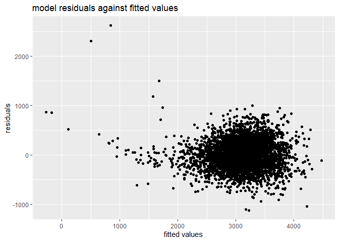
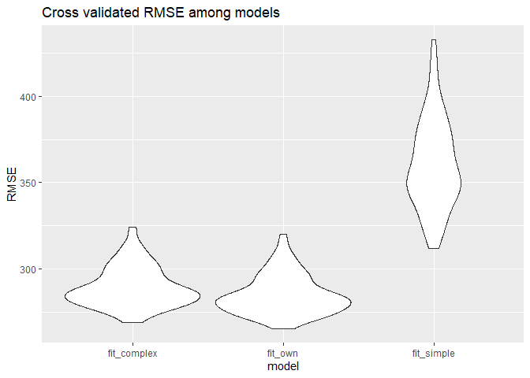

p8105_hw6_hz2771
================
Haolin Zhong (UNI: hz2771)
2021/12/3

### Import dependencies

``` r
library(tidyverse)
library(modelr)
```

## Problem 1

### Load and clean data

Here we load and clean the data. In the data cleaning process, we
transformed `babysex`, `frace`, `mrace`, `malform` into factors. In
addition, we also ascertained that there is no missing data.

``` r
data_path = "./data/birthweight.csv"

bwt = read_csv(data_path) %>% 
  janitor::clean_names() %>% 
  mutate(
    babysex = as.factor(babysex),
    babysex = fct_recode(babysex, "male" = "1", "female" = "2"),
    frace = as.factor(frace),
    frace = fct_recode(frace,
                       "white" = "1", 
                       "black" = "2", 
                       "asian" = "3", 
                       "puerto rican" = "4",
                       "other" = "8",
                       "unknown" = "9"),
    mrace = as.factor(mrace),
    mrace = fct_recode(mrace,
                       "white" = "1", 
                       "black" = "2", 
                       "asian" = "3", 
                       "puerto rican" = "4",
                       "other" = "8"),
    malform = as.factor(malform),
    malform = fct_recode(malform,
                         "absent" = "0",
                         "present" = "1")
    
  )

skimr::skim(bwt)[c(2,4)] %>% t() %>% knitr::kable()
```

|               |         |       |         |       |       |         |     |       |         |         |          |         |        |        |         |         |       |      |        |        |
|:--------------|:--------|:------|:--------|:------|:------|:--------|:----|:------|:--------|:--------|:---------|:--------|:-------|:-------|:--------|:--------|:------|:-----|:-------|:-------|
| skim_variable | babysex | frace | malform | mrace | bhead | blength | bwt | delwt | fincome | gaweeks | menarche | mheight | momage | parity | pnumlbw | pnumsga | ppbmi | ppwt | smoken | wtgain |
| complete_rate | 1       | 1     | 1       | 1     | 1     | 1       | 1   | 1     | 1       | 1       | 1        | 1       | 1      | 1      | 1       | 1       | 1     | 1    | 1      | 1      |

### Build models

At first, we build one model of our own. Intuitively, we consider
several variables, including `babysex`, `bhead`, `blength`, `wtgain`,
`ppwt`, `pnumlbw`, may be strong predictors of infant birth weight.
Therefore, we build models using every subsets of these variables, and
choose the best model which has the smallest BIC value.

``` r
# find all possible subsets of variables
vset = unlist(lapply(1:6, 
                    combn, 
                    x = c("babysex", "bhead", "blength", "wtgain", "ppwt", "pnumlbw"), 
                    simplify = FALSE), 
              recursive = FALSE)

calc_BIC = function(variables){
  formula = as.formula(paste("bwt", paste(variables, collapse = " + "), sep = "~"))
  model = lm(formula, bwt)
  return(broom::glance(model) %>% pull("BIC"))
}

# calculate BIC value of every model
BICs = map(vset, calc_BIC) %>% as_vector()

# choose model with the lowest BIC
index = which(BICs == min(BICs))[[1]]
variables = vset[[index]]
formula = as.formula(paste("bwt", paste(variables, collapse = " + "), sep = "~"))
fit_own = lm(formula, bwt)

bwt %>% 
  add_residuals(fit_own) %>% 
  add_predictions(fit_own) %>% 
  ggplot(aes(x = pred, y =resid)) +
  geom_point() +
  labs(
    x = "fitted values",
    y = "residuals",
    title = "model residuals against fitted values"
  )
```

<!-- -->

Finally, our model used `babysex`, `bhead`, `blength`, `wtgain`, `ppwt`
as features.

Then, we build two other models, one using length at birth and
gestational age as predictors, one using head circumference, length,
sex, and all interactions between these and compare the previous model
with the two models. We then compare the three models’ cross-validated
prediction error, i.e. RMSE.

``` r
crossv_mc(bwt, 100) %>% 
  mutate(
    fit_own = map(train, ~lm(bwt ~ babysex + bhead + blength + wtgain + ppwt, data = .x)),
    fit_simple = map(train, ~lm(bwt ~ blength + gaweeks, bwt, data = .x)),
    fit_complex = map(train, ~lm(bwt ~ bhead * blength * babysex, data = .x))
  ) %>% 
  mutate(
    error_fit_own = map2_dbl(fit_own, test, rmse),
    error_fit_simple = map2_dbl(fit_simple, test, rmse),
    error_fit_complex = map2_dbl(fit_complex, test, rmse)
  ) %>% 
  select("error_fit_own":"error_fit_complex") %>% 
  pivot_longer(names_to = "model", names_prefix = "error_", values_to = "rmse",
               cols = everything()) %>% 
  ggplot(aes(x = model, y = rmse)) +
  geom_violin() +
  labs(
    y = "RMSE",
    title = "Cross validated RMSE among models"
  )
```

<!-- -->

We found that our own model has the lowest cross-validated RMSE, while
the simple model has the largest cross-validated RMSE.
